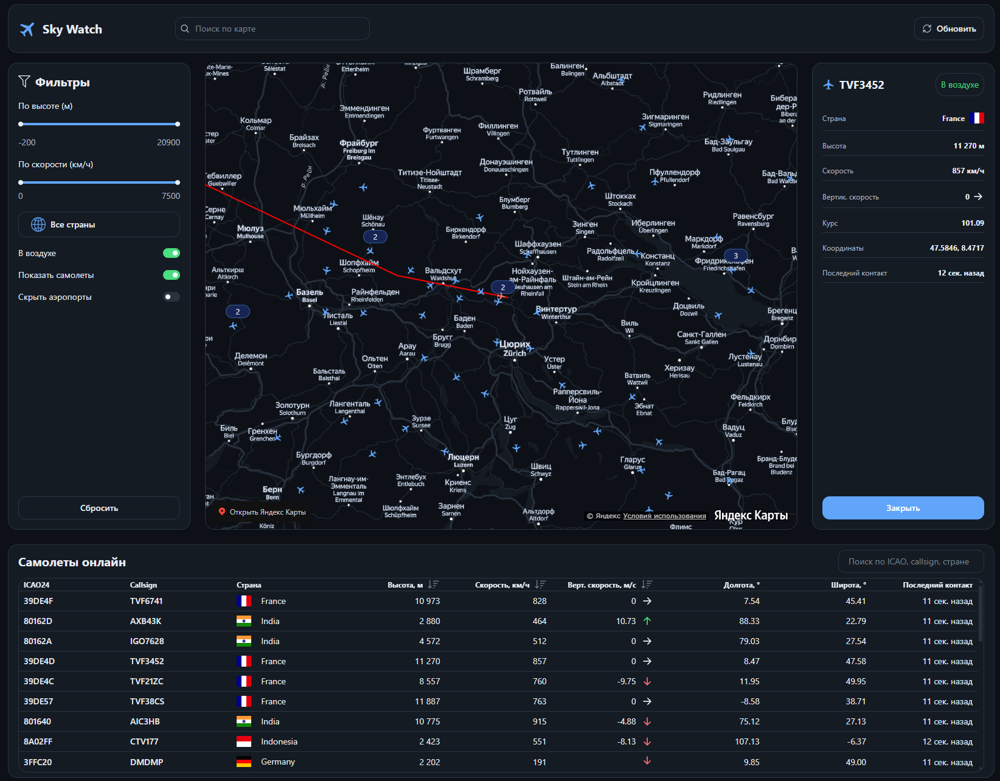

# Sky Watch

Веб-дашборд мониторинга воздушного движения: карта Яндекс, рейсы OpenSky Network, фильтры, список и карточки объектов.
  <br>


## Возможности

- Интерактивная карта (Yandex Maps API) с кластеризацией самолётов и аэропортов
- Отображение данных о воздушных рейсах через OpenSky Network
- Фильтры: высота, скорость, страна, на земле / в воздухе, видимость слоёв
- Список рейсов (таблица на desktop, карточки на mobile) с поиском и сортировкой
- Детали самолёта и аэропорта (прибытия / отправления)
- Поиск по карте (Yandex Geocoder)
- Адаптивный интерфейс

## Стек

🛠️ Stack:
- Next.js
- React
- TypeScript
- TanStack Query
- Zustand
- Tailwind CSS
- Yandex Maps JS API 
- Yandex Geocoder API

Архитектура ориентирована на Feature-Sliced Design: `app` / `widgets` / `features` / `entities` / `shared`.

## Требования

- Аккаунты и ключи:
  - [OpenSky Network](https://opensky-network.org/) — Client ID / Secret (OAuth2)
  - [Yandex Maps](https://developer.tech.yandex.ru/) — ключ JS API
  - [Yandex Geocoder](https://developer.tech.yandex.ru/) — ключ HTTP Геокодера

## Быстрый старт

🔗 Установка:

Установка зависимостей:
```sh 
npm install
```
Запуск сервера разработки:
```sh
npm run dev
```
Сборка production версии:
```sh
npm run build
```

Запуск production сборки:
```sh
npm run start
```
